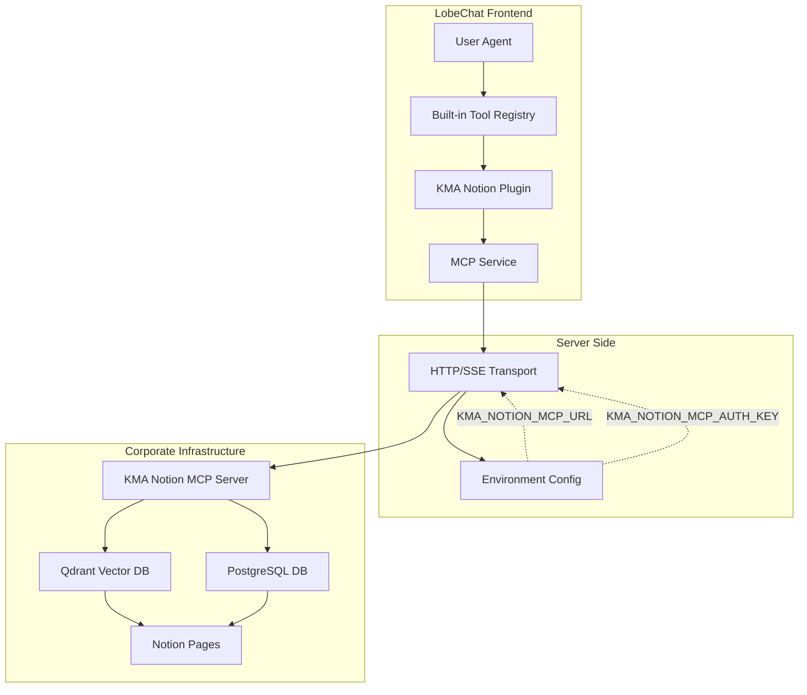

# KMA Notion Built-in Plugin - Technical Design Document

## Overview

This document outlines the technical architecture for the `kma-notion` built-in plugin that connects to a corporate HTTP streaming MCP server to provide semantic search and page retrieval capabilities from Kiss My Apps (KMA) company's Notion knowledge base.

## 1. Architecture Overview



### Key Components

1. **Built-in Plugin Package**: `packages/builtin-tool-kma-notion/`
2. **Environment Configuration**: Defined in `src/envs/tools.ts`
3. **Plugin Registration**: Added to `src/tools/index.ts`
4. **Default Enablement**: Added to `defaultToolIds` in tool engineering modules
5. **MCP Connection**: HTTP/SSE streaming connection with Bearer authentication

## 2. Package Structure

### Directory Layout

```
packages/builtin-tool-kma-notion/
├── package.json
├── src/
│   ├── index.ts              # Main exports
│   ├── manifest.ts           # Tool manifest definition
│   ├── types.ts              # TypeScript types
│   ├── systemRole.ts         # System prompt for AI
│   ├── const.ts              # Constants and env variable names
│   └── client/              # Optional UI components
│       ├── index.ts
│       ├── Inspector/
│       │   ├── index.ts
│       │   ├── QueryVector/
│       │   │   └── index.tsx
│       │   └── GetPage/
│       │       └── index.tsx
│       └── Render/
│           ├── index.ts
│           ├── QueryVector/
│           │   └── index.tsx
│           └── GetPage/
│               └── index.tsx
```

## 3. Key Files Specification

### 3.1 `package.json`

```json
{
  "name": "@lobechat/builtin-tool-kma-notion",
  "version": "1.0.0",
  "private": true,
  "exports": {
    ".": "./src/index.ts",
    "./client": "./src/client/index.ts"
  },
  "main": "./src/index.ts",
  "dependencies": {
    "@lobechat/prompts": "workspace:*"
  },
  "devDependencies": {
    "@lobechat/types": "workspace:*"
  },
  "peerDependencies": {
    "@lobehub/ui": "^4",
    "antd": "^6",
    "antd-style": "*",
    "react": "*",
    "react-i18next": "*"
  }
}
```

### 3.2 `src/const.ts`

```typescript
/**
 * KMA Notion Plugin Constants
 */

// Environment variable names
export const ENV_KMA_NOTION_MCP_URL = 'KMA_NOTION_MCP_URL';
export const ENV_KMA_NOTION_MCP_AUTH_KEY = 'KMA_NOTION_MCP_AUTH_KEY';

// Default values
export const DEFAULT_TOP_K = 5;
export const MIN_TOP_K = 1;
export const MAX_TOP_K = 20;
```

### 3.3 `src/types.ts`

```typescript
import type { z } from 'zod';

/**
 * KMA Notion Plugin Identifier
 */
export const KmaNotionIdentifier = 'kma-notion';

/**
 * API Names
 */
export const KmaNotionApiName = {
  queryVector: 'query_vector',
  getPage: 'get_page',
} as const;

/**
 * Query Vector Arguments
 */
export interface QueryVectorArgs {
  query: string;
  topK?: number;
}

/**
 * Query Vector Result Item
 */
export interface QueryVectorResultItem {
  score: number;
  pageId: string;
  text: string;
}

/**
 * Query Vector State
 */
export interface QueryVectorState {
  results: QueryVectorResultItem[];
  totalResults: number;
}

/**
 * Get Page Arguments
 */
export interface GetPageArgs {
  pageId: string;
}

/**
 * Get Page State
 */
export interface GetPageState {
  text: string;
  createdAt: string;
  updatedAt: string;
  parentId: string | null;
}
```

### 3.4 `src/manifest.ts`

```typescript
import { BuiltinToolManifest } from '@lobechat/types';

import { systemPrompt } from './systemRole';
import { KmaNotionApiName, KmaNotionIdentifier } from './types';
import { DEFAULT_TOP_K, MAX_TOP_K, MIN_TOP_K } from './const';

export const KmaNotionManifest: BuiltinToolManifest = {
  api: [
    {
      description:
        'Perform semantic search over the corporate Notion knowledge base at Kiss My Apps (KMA). Returns relevant page chunks with similarity scores. Use this first to discover which pages contain information relevant to your query. IMPORTANT: Since this uses vector-based semantic search, always resolve pronouns and references to concrete entities before searching.',
      name: KmaNotionApiName.queryVector,
      parameters: {
        properties: {
          query: {
            description:
              'The search query text. Be specific and use concrete entities. IMPORTANT: Resolve all pronouns and references to actual entity names before searching, as vector search works best with concrete terms.',
            type: 'string',
          },
          topK: {
            default: DEFAULT_TOP_K,
            description: `Number of top relevant results to return (default: ${DEFAULT_TOP_K}, min: ${MIN_TOP_K}, max: ${MAX_TOP_K})`,
            maximum: MAX_TOP_K,
            minimum: MIN_TOP_K,
            type: 'number',
          },
        },
        required: ['query'],
        type: 'object',
      },
    },
    {
      description:
        'Get the full content of a specific Notion page by its ID. Use this after query_vector to retrieve complete page information. Returns page content in markdown format along with metadata.',
      name: KmaNotionApiName.getPage,
      parameters: {
        properties: {
          pageId: {
            description:
              'UUID of the Notion page to retrieve. Obtain this from query_vector results.',
            format: 'uuid',
            type: 'string',
          },
        },
        required: ['pageId'],
        type: 'object',
      },
    },
  ],
  identifier: KmaNotionIdentifier,
  meta: {
    avatar: '📔',
    description: 'Search and retrieve information from KMA corporate Notion knowledge base',
    title: 'KMA Notion',
  },
  systemRole: systemPrompt,
  type: 'builtin',
};
```

### 3.5 `src/systemRole.ts`

```typescript
/**
 * System prompt for KMA Notion tool
 */
export const systemPrompt = `You have access to the Kiss My Apps (KMA) corporate Notion knowledge base, which contains company documentation, processes, and institutional knowledge.

## Available Tools

1. **query_vector**: Search the Notion knowledge base using semantic search
   - Use this first to find relevant information
   - Always use concrete, specific terms (resolve pronouns like "it" or "that")
   - Returns chunks of relevant content with similarity scores and page IDs

2. **get_page**: Retrieve full content of a specific Notion page
   - Use this after query_vector to get complete page details
   - Requires a page ID from search results

## Best Practices

- Start with query_vector to discover relevant pages
- Use specific, descriptive search queries for better results
- Read full pages with get_page when you need complete context
- Reference page titles and URLs when citing information
- Be aware that results are from corporate documentation and may contain internal information

## Workflow Example

1. User asks about a KMA process or policy
2. Use query_vector with specific keywords
3. Review search results and their relevance scores
4. Use get_page to retrieve full content of the most relevant pages
5. Synthesize information and provide answer with references`;
```

### 3.6 `src/index.ts`

```typescript
export { KmaNotionManifest } from './manifest';
export { systemPrompt } from './systemRole';
export {
  type GetPageArgs,
  type GetPageState,
  KmaNotionApiName,
  KmaNotionIdentifier,
  type QueryVectorArgs,
  type QueryVectorResultItem,
  type QueryVectorState,
} from './types';
export {
  DEFAULT_TOP_K,
  ENV_KMA_NOTION_MCP_AUTH_KEY,
  ENV_KMA_NOTION_MCP_URL,
  MAX_TOP_K,
  MIN_TOP_K,
} from './const';
```

## 4. Environment Configuration

### 4.1 Update `src/envs/tools.ts`

Add the KMA Notion environment variables:

```typescript
import { createEnv } from '@t3-oss/env-nextjs';
import { z } from 'zod';

export const getToolsConfig = () => {
  return createEnv({
    runtimeEnv: {
      CRAWLER_IMPLS: process.env.CRAWLER_IMPLS,
      SEARCH_PROVIDERS: process.env.SEARCH_PROVIDERS,
      SEARXNG_URL: process.env.SEARXNG_URL,
      // Add KMA Notion configuration
      KMA_NOTION_MCP_URL: process.env.KMA_NOTION_MCP_URL,
      KMA_NOTION_MCP_AUTH_KEY: process.env.KMA_NOTION_MCP_AUTH_KEY,
    },

    server: {
      CRAWLER_IMPLS: z.string().optional(),
      SEARCH_PROVIDERS: z.string().optional(),
      SEARXNG_URL: z.string().url().optional(),
      // Add KMA Notion validation
      KMA_NOTION_MCP_URL: z.string().url().optional(),
      KMA_NOTION_MCP_AUTH_KEY: z.string().optional(),
    },
  });
};

export const toolsEnv = getToolsConfig();
```

### 4.2 Update `.env.example`

Add KMA Notion environment variables:

```bash
# KMA Notion MCP Server Configuration
# URL of the corporate MCP server
KMA_NOTION_MCP_URL=https://your-mcp-server.example.com/mcp

# Authentication key for the MCP server
KMA_NOTION_MCP_AUTH_KEY=your-bearer-token-here
```

## 5. Plugin Registration

### 5.1 Update `src/tools/index.ts`

Register the KMA Notion plugin:

```typescript
import { AgentBuilderManifest } from '@lobechat/builtin-tool-agent-builder';
import { CloudSandboxManifest } from '@lobechat/builtin-tool-cloud-sandbox';
// ... other imports
import { KmaNotionManifest } from '@lobechat/builtin-tool-kma-notion';
import { isDesktop } from '@lobechat/const';
import { type LobeBuiltinTool } from '@lobechat/types';

import { ArtifactsManifest } from './artifacts';

export const builtinTools: LobeBuiltinTool[] = [
  {
    identifier: ArtifactsManifest.identifier,
    manifest: ArtifactsManifest,
    type: 'builtin',
  },
  // ... other tools
  
  // Add KMA Notion plugin
  {
    identifier: KmaNotionManifest.identifier,
    manifest: KmaNotionManifest,
    type: 'builtin',
    // NOT hidden - visible to all users
  },
  
  // ... rest of tools
];
```

## 6. MCP Connection Strategy

### 6.1 Connection Configuration

The KMA Notion plugin uses HTTP streaming MCP connection. The configuration is structured as follows:

```typescript
// Plugin configuration structure
const pluginConfig = {
  identifier: 'kma-notion',
  manifest: KmaNotionManifest,
  type: 'builtin' as const,
  customParams: {
    mcp: {
      type: 'http' as const,
      url: toolsEnv.KMA_NOTION_MCP_URL, // From environment
      headers: {
        'Authorization': `Bearer ${toolsEnv.KMA_NOTION_MCP_AUTH_KEY}`,
      },
    },
  },
};
```

### 6.2 MCP Service Integration

The existing [`mcpService.invokeMcpToolCall()`](src/services/mcp.ts:34) method in `src/services/mcp.ts` already handles HTTP MCP connections:

1. **HTTP Connection Handling** (lines 73-78):
   - When `connection.type === 'http'`, headers are merged with plugin settings
   - Authentication header is included automatically

2. **Tool Invocation Flow**:
   ```
   User Agent Request
   → mcpService.invokeMcpToolCall()
   → toolsClient.mcp.callTool.mutate()
   → HTTP/SSE request to MCP server
   → MCP server processes request
   → Streaming response returned
   ```

3. **No Custom Code Required**: The existing MCP infrastructure handles:
   - HTTP/SSE streaming transport
   - Bearer token authentication via headers
   - Request/response serialization
   - Error handling and reporting

### 6.3 Environment-Based Configuration Loading

Since this is a built-in plugin with environment-based configuration, we need to ensure the connection parameters are injected at runtime. Create a configuration initializer:

**New file: `src/server/services/kmaNotion/config.ts`**

```typescript
import { toolsEnv } from '@/envs/tools';

export interface KmaNotionConfig {
  enabled: boolean;
  mcpUrl?: string;
  authKey?: string;
}

/**
 * Get KMA Notion plugin configuration from environment
 */
export function getKmaNotionConfig(): KmaNotionConfig {
  const mcpUrl = toolsEnv.KMA_NOTION_MCP_URL;
  const authKey = toolsEnv.KMA_NOTION_MCP_AUTH_KEY;
  
  const enabled = !!(mcpUrl && authKey);
  
  return {
    enabled,
    mcpUrl,
    authKey,
  };
}

/**
 * Get MCP connection parameters for KMA Notion
 */
export function getKmaNotionMcpConnection() {
  const config = getKmaNotionConfig();
  
  if (!config.enabled) {
    return null;
  }
  
  return {
    type: 'http' as const,
    url: config.mcpUrl!,
    headers: {
      'Authorization': `Bearer ${config.authKey}`,
    },
  };
}
```

### 6.4 Dynamic Plugin Configuration

Since built-in plugins are registered statically but need environment-based MCP configuration, we need to inject the connection at runtime. Update the plugin store initialization:

**Update: `src/store/tool/store.ts` (conceptual)**

The plugin store should check for KMA Notion configuration and inject the MCP connection when the plugin is accessed:

```typescript
// In the plugin selector or initialization code
import { getKmaNotionMcpConnection } from '@/server/services/kmaNotion/config';
import { KmaNotionIdentifier } from '@lobechat/builtin-tool-kma-notion';

// When loading plugin configuration
if (plugin.identifier === KmaNotionIdentifier) {
  const mcpConnection = getKmaNotionMcpConnection();
  if (mcpConnection) {
    plugin.customParams = {
      mcp: mcpConnection,
    };
  }
}
```

## 7. Default Enablement Strategy

### 7.1 Add to Default Tools List

**Update: `src/helpers/toolEngineering/index.ts`**

Add KMA Notion to the default tools list in [`createAgentToolsEngine()`](src/helpers/toolEngineering/index.ts:81):

```typescript
import { KmaNotionManifest } from '@lobechat/builtin-tool-kma-notion';
// ... other imports

export const createAgentToolsEngine = (workingModel: WorkingModel) =>
  createToolsEngine({
    // Add default tools based on configuration
    defaultToolIds: [
      WebBrowsingManifest.identifier,
      KnowledgeBaseManifest.identifier,
      KmaNotionManifest.identifier, // Add KMA Notion
    ],
    enableChecker: ({ pluginId }) => {
      // Check platform-specific constraints
      if (!shouldEnableTool(pluginId)) {
        return false;
      }
      
      // For WebBrowsingManifest, apply search logic
      if (pluginId === WebBrowsingManifest.identifier) {
        const searchConfig = getSearchConfig(workingModel.model, workingModel.provider);
        return searchConfig.useApplicationBuiltinSearchTool;
      }

      // For KnowledgeBaseManifest, only enable if knowledge is enabled
      if (pluginId === KnowledgeBaseManifest.identifier) {
        const agentState = getAgentStoreState();
        return agentSelectors.hasEnabledKnowledgeBases(agentState);
      }
      
      // For KMA Notion, enable only if configured
      if (pluginId === KmaNotionManifest.identifier) {
        const config = getKmaNotionConfig();
        return config.enabled;
      }

      // For all other plugins, enable by default
      return true;
    },
  });
```

**Update: `src/server/modules/Mecha/AgentToolsEngine/index.ts`**

Add KMA Notion to server-side default tools in [`createServerAgentToolsEngine()`](src/server/modules/Mecha/AgentToolsEngine/index.ts:85):

```typescript
import { KmaNotionManifest } from '@lobechat/builtin-tool-kma-notion';
// ... other imports

export const createServerAgentToolsEngine = (
  context: ServerAgentToolsContext,
  params: ServerCreateAgentToolsEngineParams,
): ToolsEngine => {
  // ... existing code
  
  return createServerToolsEngine(context, {
    additionalManifests,
    // Add default tools based on configuration
    defaultToolIds: [
      WebBrowsingManifest.identifier,
      KnowledgeBaseManifest.identifier,
      KmaNotionManifest.identifier, // Add KMA Notion
    ],
    enableChecker: ({ pluginId }) => {
      // Filter LocalSystem tool on server
      if (pluginId === LocalSystemManifest.identifier) {
        return false;
      }

      // For WebBrowsingManifest, apply search logic
      if (pluginId === WebBrowsingManifest.identifier) {
        return isSearchEnabled;
      }

      // For KnowledgeBaseManifest, only enable if knowledge is enabled
      if (pluginId === KnowledgeBaseManifest.identifier) {
        return hasEnabledKnowledgeBases;
      }
      
      // For KMA Notion, enable only if configured
      if (pluginId === KmaNotionManifest.identifier) {
        const config = getKmaNotionConfig();
        return config.enabled;
      }

      // For all other plugins, enable by default
      return true;
    },
  });
};
```

### 7.2 Enablement Logic

The KMA Notion plugin will be enabled by default when:
1. `KMA_NOTION_MCP_URL` is set and valid
2. `KMA_NOTION_MCP_AUTH_KEY` is set
3. The plugin is included in `defaultToolIds`

If environment variables are not configured, the plugin will:
- Still appear in the tools list
- Be automatically disabled by the `enableChecker`
- Display a configuration warning in the UI (optional future enhancement)

## 8. Implementation Checklist

### Core Implementation

- [ ] Create package directory: `packages/builtin-tool-kma-notion/`
- [ ] Create `package.json` with dependencies
- [ ] Create `src/const.ts` with environment variable names
- [ ] Create `src/types.ts` with TypeScript interfaces
- [ ] Create `src/manifest.ts` with tool definitions
- [ ] Create `src/systemRole.ts` with AI prompt
- [ ] Create `src/index.ts` with exports

### Environment Configuration

- [ ] Update `src/envs/tools.ts` to include KMA Notion env vars
- [ ] Add `KMA_NOTION_MCP_URL` to environment configuration
- [ ] Add `KMA_NOTION_MCP_AUTH_KEY` to environment configuration
- [ ] Update `.env.example` with KMA Notion variables

### Plugin Registration

- [ ] Import KMA Notion manifest in `src/tools/index.ts`
- [ ] Add KMA Notion to `builtinTools` array
- [ ] Ensure plugin is NOT marked as hidden

### MCP Integration

- [ ] Create `src/server/services/kmaNotion/config.ts`
- [ ] Implement `getKmaNotionConfig()` function
- [ ] Implement `getKmaNotionMcpConnection()` function
- [ ] Inject MCP configuration at runtime in plugin store

### Default Enablement

- [ ] Add KMA Notion to `defaultToolIds` in `src/helpers/toolEngineering/index.ts`
- [ ] Add enable checker logic for KMA Notion
- [ ] Add KMA Notion to `defaultToolIds` in `src/server/modules/Mecha/AgentToolsEngine/index.ts`
- [ ] Add enable checker logic for KMA Notion (server-side)

### Optional Enhancements

- [ ] Create UI components in `src/client/Inspector/` for result display
- [ ] Create UI components in `src/client/Render/` for formatted output
- [ ] Add i18n keys for plugin name and descriptions
- [ ] Add plugin configuration UI for admin settings
- [ ] Add connection status indicator

### Testing & Documentation

- [ ] Write unit tests for type definitions
- [ ] Test MCP connection with mock server
- [ ] Test authentication flow
- [ ] Test both tools (query_vector and get_page)
- [ ] Update user documentation
- [ ] Create admin setup guide

## 9. Special Considerations

### 9.1 Security

- **Authentication**: Bearer token stored in environment variable (server-side only)
- **Access Control**: Plugin is available to all users, but respects server-side auth
- **Data Sensitivity**: Corporate Notion data should be treated as internal/confidential
- **Token Rotation**: Admins need process for updating `KMA_NOTION_MCP_AUTH_KEY`

### 9.2 Performance

- **Vector Search**: Query performance depends on Qdrant vector database
- **Default topK**: Set to 5 (balanced between relevance and response time)
- **Page Retrieval**: Full page content may be large; monitor response sizes
- **Caching**: Consider implementing caching for frequently accessed pages

### 9.3 Error Handling

- **Missing Configuration**: Plugin auto-disables if env vars not set
- **Connection Failures**: MCP service handles retries and error reporting
- **Invalid Page IDs**: Server returns appropriate error messages
- **Rate Limiting**: May need to implement if MCP server has limits

### 9.4 User Experience

- **Discovery**: Plugin appears in default tools list automatically
- **Visibility**: Not hidden - users see it in their tools panel
- **Feedback**: Tool results show relevance scores for search quality
- **Context**: System prompt guides AI on proper tool usage

### 9.5 Deployment

1. **Development**:
   - Set env vars in `.env.local`
   - Restart dev server to load configuration

2. **Production**:
   - Set env vars in hosting platform (Vercel, etc.)
   - Ensure MCP server is accessible from production environment
   - Use secure token storage/management

3. **Rollout Strategy**:
   - Deploy with env vars unset initially (plugin disabled)
   - Configure and test in staging environment
   - Enable in production by setting env vars

## 10. Future Enhancements

### Phase 2 Considerations

1. **Enhanced UI**:
   - Rich preview of search results with highlights
   - Page hierarchy visualization
   - In-line page content display

2. **Advanced Features**:
   - Filter by page metadata (created date, author, etc.)
   - Multi-query aggregation
   - Bookmark frequently accessed pages

3. **Analytics**:
   - Track most searched queries
   - Monitor tool usage patterns
   - Measure search result relevance

4. **Configuration UI**:
   - Admin panel for MCP server settings
   - Connection status monitoring
   - Test connection functionality

5. **Caching Strategy**:
   - Cache popular pages locally
   - Implement TTL-based invalidation
   - Reduce MCP server load

## 11. Summary

The KMA Notion built-in plugin provides seamless integration with the corporate Notion knowledge base through:

- **Simple Package Structure**: Standard built-in plugin layout
- **Environment-Based Config**: Secure, admin-controlled configuration
- **HTTP/SSE MCP**: Leverages existing MCP infrastructure
- **Default Enablement**: Automatically available when configured
- **Zero Custom Backend**: Uses existing MCP service layer

This design enables rapid implementation while maintaining security, performance, and user experience standards of the LobeChat platform.
